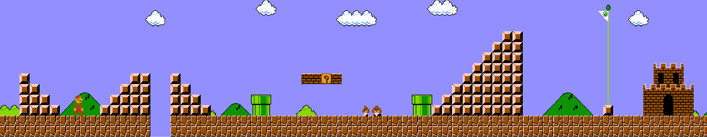

# Image Stitching

Image stitching in python and opencv:

* Perspective Stitch
* Affine Stitch

Stitching in 2D considered in Super Mario Brothers game. 

Here's a stitched image:

Next Steps:
* Build a predictive model for Mario's movement
* Implement baby 2D SLAM for Super Mario
