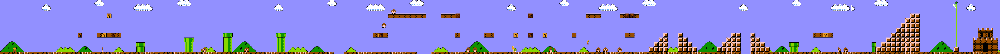

# Image Stitching

Image stitching in python and opencv:

* Perspective Stitch
* Affine Stitch

Stitching in 2D considered in Super Mario Brothers game. 

Here are a couple of stitched images:

Next Steps:
* Use cross-correlation of intersection of previous frame and current frame to measure loss
* Observe pixels over time and choose the pixel value that appears the most (This will get rid of Goombas and Koopas when building maps)
* Keyframing and Bundle Adjustment?

Future Work:
* Build a predictive model for Mario's movement
* Implement baby 2D SLAM for Super Mario
